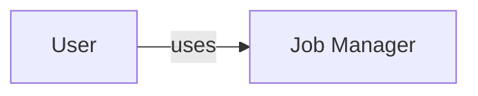
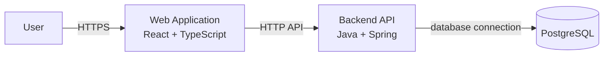
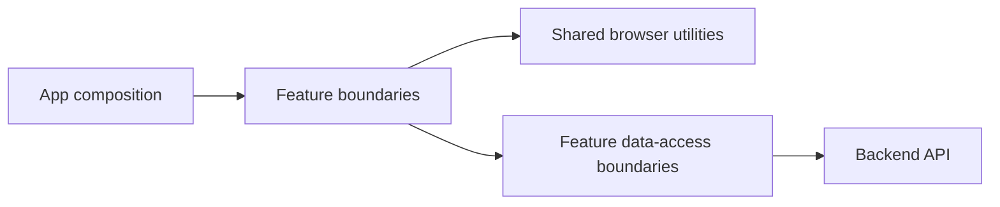
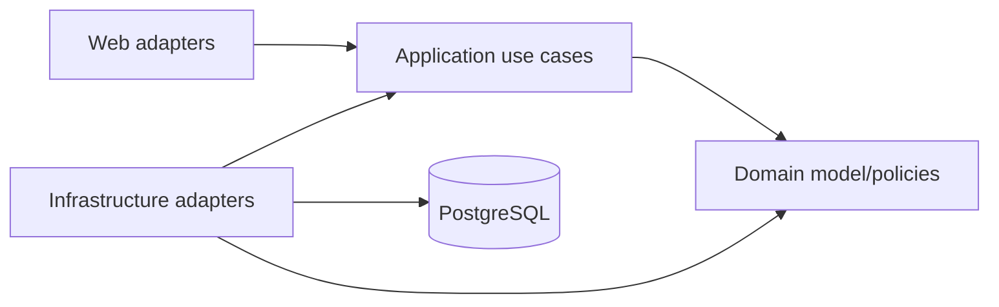

# C4 Model — Job Manager

**Status:** Draft

This document communicates system, container and major component boundaries. It
does not define feature behavior, requirements or unresolved technology choices.

## C1 — System Context

Job Manager supports web-based job-management capabilities. Specific roles,
workflows and observable behavior belong to Ready specifications when present,
or to the explicit user request authorizing work outside that workflow.

External identity, messaging, storage or third-party systems are not assumed
until accepted architecture and an applicable specification or explicit user
request require them.

## C2 — Containers

### Web Application

Owns browser presentation, interaction, client-side state, accessibility and
frontend tests. It does not access the database.

### Backend API

Owns server-side application behavior, HTTP adaptation, authorization,
validation, transactions, persistence coordination and backend tests.

### PostgreSQL

Owns persisted relational data. Flyway owns schema evolution; application code
must not rely on automatic production schema mutation.

## C3 — Frontend major components

- app composition owns providers and top-level orchestration;
- feature boundaries own capability-specific UI/state;
- data-access boundaries isolate transport DTOs and HTTP mechanics;
- shared code contains reusable browser concerns without feature requirements.

Actual feature directories are introduced by applicable Ready packages or by
explicitly authorized implementation work outside the package workflow.

## C3 — Backend major components

- web adapters translate HTTP and external validation;
- application use cases coordinate behavior and transactions;
- domain objects/policies contain framework-independent behavior when justified;
- infrastructure adapts persistence and external mechanisms.

Dependencies must not make domain/application behavior depend on transport or
concrete infrastructure.

## Relationships and contracts

The frontend/backend relationship is governed by
[Contract Architecture](contracts.md). A formal OpenAPI representation exists
when required by an applicable specification or directly authorized work.

## Trust boundaries

- browser input is untrusted;
- authentication/authorization must be enforced by the backend;
- persistence is not directly reachable from the frontend;
- secrets and sensitive data must not cross boundaries without explicit need;
- external services, when introduced, form additional trust boundaries that
  require architecture/security review.

## Deployment view

Only the logical separation of frontend, backend and PostgreSQL is established.
Provider, topology, CI/CD and observability choices remain in
[Open Architecture Decisions](open-decisions.md).
