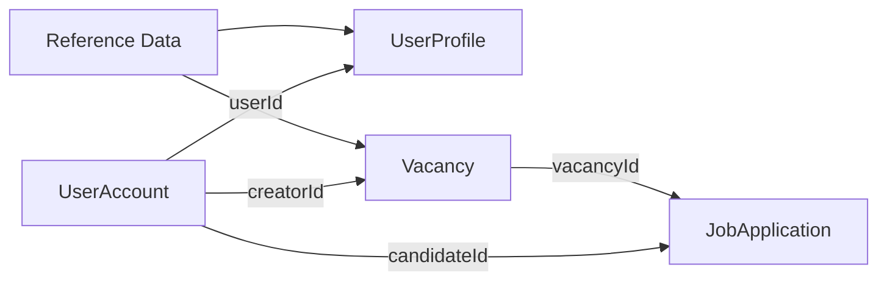
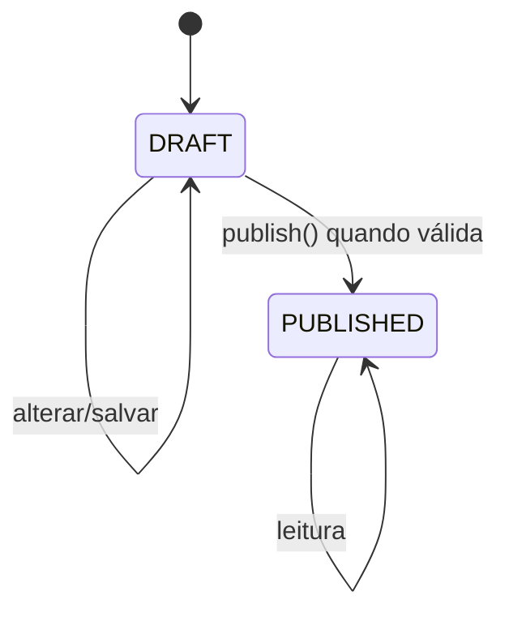
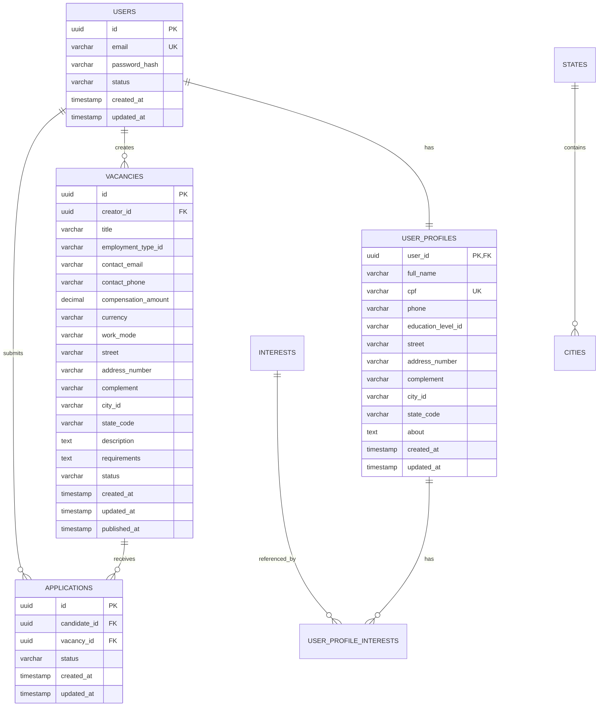

# Modelo de Domínio — Job Manager

**Status:** Draft
**Abordagem principal:** Domain-Driven Design (DDD) tático, alimentado pelo Event Storming
**Objetivo:** registrar candidatos de modelo e vocabulário para refinement; este documento não é autoridade normativa para uma spec Ready.

---

# 1. Escopo

Este documento modela o domínio necessário para suportar as funcionalidades atualmente identificadas:

- autenticação de usuário;
- manutenção de perfil;
- interesses profissionais;
- criação de vagas;
- vaga presencial ou remota;
- salvamento de rascunho;
- publicação de vaga;
- descoberta, busca e filtragem de vagas;
- candidatura;
- consulta das próprias candidaturas;
- dados de referência como estado, cidade, escolaridade e tipo de emprego.

O modelo evita adicionar capacidades que ainda não aparecem como requisito, como:

- workflow de recrutamento;
- aceite/rejeição de candidatos;
- chat;
- notificações;
- favoritos;
- administração;
- encerramento/arquivamento de vaga;
- entidade empresarial completa.

Esses elementos podem ser adicionados posteriormente por novas specs.

---

# 2. Princípios de modelagem

## 2.1 Linguagem ubíqua

Os termos abaixo devem ser utilizados de forma consistente no código, documentação, testes e contrato de API.

| Termo | Significado |
|---|---|
| Usuário | Pessoa que possui uma conta autenticável |
| Perfil | Informações pessoais e profissionais do usuário |
| Interesse | Área ou categoria de trabalho de interesse do usuário |
| Vaga | Oportunidade de trabalho criada por um usuário |
| Rascunho | Vaga ainda não publicada e que pode estar incompleta |
| Vaga publicada | Vaga que satisfaz as invariantes de publicação |
| Candidatura | Vínculo criado quando um usuário se candidata a uma vaga |
| Modalidade | Forma de execução da vaga: remota ou presencial |
| Publicador | Usuário proprietário da vaga |
| Candidato | Usuário que realiza uma candidatura |
| Dados de referência | Valores controlados como cidades, estados e escolaridades |

---

# 3. Bounded Contexts

A solução é dividida conceitualmente nos seguintes contextos.

```text
Identity & Access
        │
        ├──────────────► User Profile
        │
        ├──────────────► Vacancy Management
        │
        └──────────────► job-applications

Vacancy Management ───► Vacancy Discovery
        │
        └──────────────► job-applications

job-applications ──────► Vacancy Discovery

Reference Data ───────► User Profile
        └──────────────► Vacancy Management
```

## 3.1 Identity & Access

Responsável por:

- conta;
- credenciais;
- autenticação;
- sessão/token;
- autorização básica.

Não contém as regras de perfil profissional.

## 3.2 User Profile

Responsável por:

- dados pessoais;
- endereço;
- escolaridade;
- apresentação;
- interesses.

## 3.3 Vacancy Management

Responsável por:

- propriedade da vaga;
- rascunho;
- edição;
- modalidade;
- localização;
- publicação.

## 3.4 Vacancy Discovery

Responsável por modelos de leitura:

- lista de vagas;
- busca;
- filtros;
- indicador de candidatura existente.

Esse contexto não é responsável por alterar a vaga.

## 3.5 Job Applications (`job-applications`)

Responsável por:

- criação da candidatura;
- não duplicidade;
- consulta das candidaturas do usuário.

## 3.6 Reference Data

Responsável por catálogos de apoio:

- estados;
- cidades;
- escolaridades;
- tipos de emprego;
- interesses.

---

# 4. Mapa de agregados



Agregados candidatos:

1. `UserAccount`
2. `UserProfile`
3. `Vacancy`
4. `JobApplication`

Dados de referência não precisam necessariamente ser agregados de domínio ricos; podem ser catálogos persistidos ou enums contratuais.

---

# 5. Aggregate Root — UserAccount

## 5.1 Responsabilidade

Representa a identidade autenticável de uma pessoa.

Deve cuidar apenas de aspectos de identidade, não de todas as informações do perfil.

## 5.2 Atributos

```text
UserAccount
- id: UserId
- email: EmailAddress
- passwordHash: PasswordHash
- status: UserAccountStatus
- createdAt: Instant
- updatedAt: Instant
```

## 5.3 UserAccountStatus

Estado mínimo recomendado:

```text
ACTIVE
```

Não adicionar `BLOCKED`, `DISABLED`, `PENDING` ou similares sem requisito.

A estrutura pode ser preparada para evolução, mas a regra funcional só deve existir quando especificada.

## 5.4 Value Objects associados

- `UserId`
- `EmailAddress`
- `PasswordHash`

## 5.5 Comportamentos

```text
changeEmail(newEmail)
```

A existência desse comportamento depende da decisão de permitir alteração do e-mail de login pelo perfil.

Autenticação não deve ser implementada como:

```text
user.authenticate(plainPassword)
```

se a comparação de hash depender de infraestrutura.

Preferir um serviço de autenticação que:

1. obtenha a conta;
2. utilize `PasswordEncoder`;
3. verifique as credenciais;
4. emita sessão/token.

## 5.6 Repositório de domínio

```text
UserAccountRepository
- findById(UserId)
- findByEmail(EmailAddress)
- existsByEmail(EmailAddress)
- save(UserAccount)
```

---

# 6. Aggregate Root — UserProfile

## 6.1 Responsabilidade

Mantém informações pessoais e profissionais pertencentes ao usuário.

## 6.2 Estrutura

```text
UserProfile
- userId: UserId
- fullName: FullName
- cpf: Cpf?
- phone: PhoneNumber?
- educationLevelId: EducationLevelId?
- address: Address?
- about: AboutText?
- interests: Set<InterestId>
- createdAt: Instant
- updatedAt: Instant
```

O e-mail pode ser lido do `UserAccount`. Evitar manter duas fontes de verdade para o mesmo e-mail.

Se o frontend editar e-mail na tela de perfil:

```text
Profile update
    +
Account email change
```

devem ser coordenados em uma mesma operação de aplicação/transaction boundary quando necessário.

## 6.3 Identidade

O agregado é identificado por `UserId`.

Não é necessário um `profileId` adicional se a relação for estritamente 1:1.

## 6.4 Value Objects

### FullName

```text
FullName
- value: String
```

Regras candidatas:

- não vazio;
- normalização de espaços;
- tamanho máximo definido no contrato.

### Cpf

```text
Cpf
- digits: String
```

Responsabilidades:

- armazenar representação normalizada;
- validar estrutura/dígitos verificadores;
- não carregar lógica de mascaramento de resposta.

Mascaramento é uma preocupação de apresentação/serialização.

### PhoneNumber

```text
PhoneNumber
- normalized: String
```

Responsabilidades:

- normalização;
- validação do formato aceito pelo produto.

### AboutText

```text
AboutText
- value: String
```

### Address

```text
Address
- street: String
- number: String
- complement: String?
- cityId: CityId
- stateCode: StateCode
```

`Address` é Value Object.

### InterestId

Identificador de um item de catálogo de interesse.

### EducationLevelId

Identificador de um item de catálogo de escolaridade.

## 6.5 Comportamentos do agregado

```text
updatePersonalData(fullName, cpf?, phone?)
changeEducationLevel(educationLevelId?)
changeAddress(address?)
changeAbout(about?)
addInterest(interestId)
removeInterest(interestId)
replaceInterests(set)
```

## 6.6 Eventos de domínio

Eventos úteis:

```text
ProfileUpdated
InterestAddedToProfile
InterestRemovedFromProfile
```

Nem toda edição de campo precisa produzir um evento persistido.

## 6.7 Repositório

```text
UserProfileRepository
- findByUserId(UserId)
- save(UserProfile)
```

---

# 7. Aggregate Root — Vacancy

## 7.1 Responsabilidade

Representa uma oportunidade de trabalho e protege as regras de:

- ownership;
- rascunho;
- modalidade;
- localização;
- publicação.

## 7.2 Estrutura

```text
Vacancy
- id: VacancyId
- creatorId: UserId
- title: VacancyTitle?
- employmentTypeId: EmploymentTypeId?
- contact: VacancyContact?
- compensation: Money?
- workMode: WorkMode?
- address: Address?
- description: VacancyDescription?
- requirements: VacancyRequirements?
- status: VacancyStatus
- createdAt: Instant
- updatedAt: Instant
- publishedAt: Instant?
```

Campos podem ser opcionais durante `DRAFT`.

A obrigatoriedade completa aparece na transição para `PUBLISHED`.

## 7.3 VacancyStatus

Modelo mínimo:

```text
DRAFT
PUBLISHED
```

Não incluir novos estados até uma spec Ready ou solicitação explícita exigir.

## 7.4 WorkMode

```text
REMOTE
ONSITE
```

Preferível a um booleano `remote` no domínio porque:

- torna a linguagem explícita;
- evita boolean blindness;
- facilita evolução futura.

## 7.5 Value Objects

### VacancyId

Identificador da vaga.

### VacancyTitle

```text
VacancyTitle
- value: String
```

### VacancyContact

```text
VacancyContact
- email: EmailAddress
- phone: PhoneNumber
```

O contato da vaga é independente do contato pessoal do usuário.

A UI pode pré-preencher dados do perfil, mas a vaga mantém seu próprio snapshot de contato.

### Money

```text
Money
- amount: Decimal
- currency: CurrencyCode
```

Regras:

- `amount >= 0` ou `> 0`, conforme decisão de negócio;
- precisão decimal controlada;
- moeda explícita.

### VacancyDescription

Texto descritivo.

### VacancyRequirements

Texto de requisitos.

## 7.6 Comportamentos

```text
changeTitle(title)
changeEmploymentType(type)
changeContact(contact)
changeCompensation(money)
markAsRemote()
markAsOnsite()
changeAddress(address)
changeDescription(description)
changeRequirements(requirements)
saveDraft()
publish(now)
```

## 7.7 Transição de estado



Alteração de vaga publicada não está especificada neste momento.

Não implementar edição pós-publicação até existir requisito.

## 7.8 Regras de modalidade

### REMOTE

```text
workMode = REMOTE
address pode ser ausente para publicação
```

### ONSITE

```text
workMode = ONSITE
address é obrigatório para publicação
```

## 7.9 Publicação

O método:

```text
publish()
```

deve:

1. verificar que o estado atual permite publicação;
2. verificar invariantes obrigatórias;
3. alterar status para `PUBLISHED`;
4. definir `publishedAt`;
5. produzir `VacancyPublished`.

## 7.10 Eventos de domínio

```text
VacancyDraftSaved
VacancyMarkedAsRemote
VacancyMarkedAsOnsite
VacancyPublished
```

## 7.11 Repositório

```text
VacancyRepository
- findById(VacancyId)
- findDraftByIdAndCreator(VacancyId, UserId)
- save(Vacancy)
```

Consultas complexas de listagem não precisam passar por esse repositório de agregado; podem utilizar query repositories/read models.

---

# 8. Aggregate Root — JobApplication

## 8.1 Responsabilidade

Representa a candidatura de um usuário a uma vaga.

## 8.2 Estrutura

```text
JobApplication
- id: ApplicationId
- candidateId: UserId
- vacancyId: VacancyId
- status: ApplicationStatus
- createdAt: Instant
- updatedAt: Instant
```

## 8.3 ApplicationStatus

Estado mínimo:

```text
APPLIED
```

Não adicionar workflow de recrutamento sem requisito.

## 8.4 Identidade lógica

Além de `ApplicationId`, existe uma chave de negócio:

```text
(candidateId, vacancyId)
```

Essa combinação deve ser única.

## 8.5 Criação

Factory sugerida:

```text
JobApplication.submit(
    applicationId,
    candidateId,
    vacancyId,
    now
)
```

## 8.6 Eventos

```text
ApplicationSubmitted
```

## 8.7 Repositório

```text
ApplicationRepository
- existsByCandidateAndVacancy(UserId, VacancyId)
- findById(ApplicationId)
- save(JobApplication)
```

Listagem de candidaturas deve preferir read model dedicado.

---

# 9. Reference Data

## 9.1 State

```text
State
- code
- name
```

Exemplo de código:

```text
PB
SP
RJ
```

## 9.2 City

```text
City
- id
- name
- stateCode
```

Invariante:

```text
City.stateCode == selected State.code
```

## 9.3 Interest

```text
Interest
- id
- name
- active
```

`active` só é necessário se o catálogo puder ser administrado. Caso contrário, omitir.

## 9.4 EducationLevel

```text
EducationLevel
- id/code
- name
```

## 9.5 EmploymentType

```text
EmploymentType
- id/code
- name
```

Não inventar valores até serem definidos no requisito.

---

# 10. Read Models

Read models não são agregados.

São estruturas voltadas à experiência de leitura.

## 10.1 AuthenticatedUserHeader

```text
AuthenticatedUserHeader
- userId
- displayName
```

## 10.2 AvailableVacancyCard

```text
AvailableVacancyCard
- vacancyId
- title
- publisherDisplayName
- employmentType
- compensation
- workMode
- locationLabel?
- publishedAt
- alreadyApplied
```

### `publisherDisplayName`

Enquanto não existir uma entidade `Company`, o nome exibido deve ser derivado do publicador/perfil ou de uma decisão posterior.

Não criar `Company` apenas porque o card visual contém um nome de empresa.

## 10.3 VacancySearchResult

Pode reutilizar `AvailableVacancyCard`.

## 10.4 MyApplicationCard

```text
MyApplicationCard
- applicationId
- vacancyId
- title
- publisherDisplayName
- compensation
- locationLabel
- appliedAt
- applicationStatus
```

## 10.5 AppliedVacancyDetails

```text
AppliedVacancyDetails
- application
- vacancy
- publisher display data
```

## 10.6 MyVacancyDraftItem

```text
MyVacancyDraftItem
- vacancyId
- title?
- workMode?
- updatedAt
```

## 10.7 MyProfileView

```text
MyProfileView
- fullName
- email
- cpf
- phone
- educationLevel
- address
- about
- interests[]
```

---

# 11. Domain Services e Policies

Usar Domain Service somente quando a regra não pertencer naturalmente a um único agregado.

## 11.1 ApplicationEligibilityPolicy

Responsabilidade:

avaliar se uma candidatura pode ser criada.

Entrada:

```text
candidateId
vacancy
existingApplication?
```

Regras possíveis:

```text
vacancy.status == PUBLISHED
application não existe
```

A regra:

```text
candidateId != vacancy.creatorId
```

permanece como decisão em aberto até ser confirmada.

## 11.2 VacancyPublicationPolicy

Preferência:

colocar as invariantes de publicação diretamente em `Vacancy`.

Criar serviço separado apenas se a validação depender de dados externos ao agregado.

---

# 12. Application Services

Application Services orquestram casos de uso.

Eles não devem concentrar regras que pertencem ao domínio.

## 12.1 AuthenticateUser

```text
AuthenticateUserHandler
```

Fluxo:

1. normalizar e-mail;
2. buscar conta;
3. comparar senha;
4. emitir sessão/token;
5. retornar usuário autenticado.

## 12.2 UpdateMyProfile

```text
UpdateMyProfileHandler
```

Fluxo:

1. obter `userId` do contexto autenticado;
2. carregar perfil;
3. validar dados de referência;
4. alterar agregado;
5. persistir;
6. atualizar e-mail da conta, se aplicável.

## 12.3 SaveVacancyDraft

```text
SaveVacancyDraftHandler
```

Fluxo:

1. identificar usuário;
2. carregar ou criar rascunho;
3. aplicar alterações;
4. validar somente invariantes estruturais;
5. salvar.

## 12.4 PublishVacancy

```text
PublishVacancyHandler
```

Fluxo:

1. carregar rascunho pertencente ao usuário;
2. chamar `vacancy.publish()`;
3. persistir;
4. publicar evento interno, se utilizado.

## 12.5 ApplyToVacancy

```text
ApplyToVacancyHandler
```

Fluxo:

1. carregar vaga;
2. verificar `PUBLISHED`;
3. verificar duplicidade;
4. aplicar políticas adicionais;
5. criar `JobApplication`;
6. persistir.

---

# 13. Modelo relacional candidato

O modelo físico não deve determinar o domínio, mas pode refletir seus limites.



## 13.1 Constraints indispensáveis

```text
users.email UNIQUE
applications(candidate_id, vacancy_id) UNIQUE
```

Se CPF for único:

```text
user_profiles.cpf UNIQUE
```

Essa regra só deve ser aplicada se a decisão de domínio confirmar unicidade.

---

# 14. Mapeamento domínio → API

A API não deve expor diretamente entidades JPA.

Exemplo:

```text
Vacancy
    ↓ mapper
VacancyResponse
```

Input:

```text
CreateOrUpdateVacancyRequest
```

Output:

```text
VacancyResponse
VacancyCardResponse
MyApplicationResponse
ProfileResponse
```

---

# 15. Mapeamento domínio → frontend

O frontend deve consumir contratos, não entidades internas.

Exemplo:

```text
GET /vacancies
        ↓
AvailableVacancyDto[]
        ↓
VacancyRepository (frontend)
        ↓
useVacancies()
        ↓
VacancyCard
```

O componente visual não deve conhecer:

- URL do endpoint;
- fetch/axios;
- headers;
- token;
- formato interno do banco.

---

# 16. Open decisions

Material unresolved questions are centralized in
[Open Domain Decisions](open-decisions.md). This Draft model must not encode a
silent answer to them.

---

# 17. Relação com a arquitetura de implementação

Este documento não define a estrutura física de packages do backend nem as
pastas do frontend.

Essas decisões pertencem a:

```text
docs/architecture/backend.md
docs/architecture/frontend.md
docs/architecture/repository.md
```

O modelo de domínio deve permanecer independente de:

- Spring MVC;
- JPA;
- PostgreSQL;
- HTTP;
- JSON;
- React;
- OpenAPI.

Um conceito de domínio não precisa mapear 1:1 para:

- package;
- tabela;
- entidade JPA;
- endpoint;
- DTO;
- componente React.

O mapeamento deve existir apenas quando responsabilidades reais justificarem a
separação.

---

# 18. Critério de completude

Este modelo fornece contexto suficiente para iniciar refinement de:

- especificação de regras;
- Architecture Drivers;
- C4;
- OpenAPI;
- schema inicial;
- specs de feature.

Itens marcados como `Hotspot` ou Open não devem ser silenciosamente inventados durante specification ou implementação.

A spec Ready ou solicitação explícita correspondente deve:

1. resolver o hotspot; ou
2. declarar explicitamente que ele está fora de escopo.
